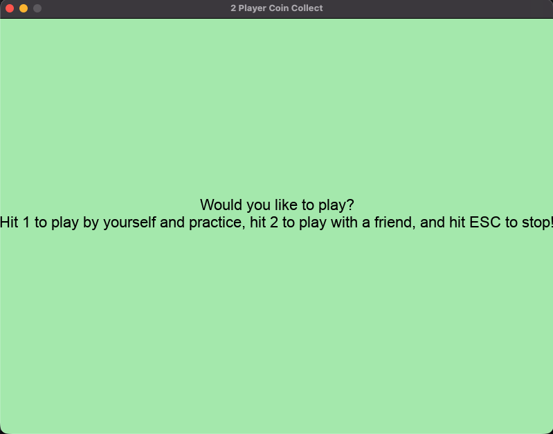

# Mariyo Coin Collect Challenge

> This is a fun 2 player game containing characters from the hit game "Super Mariyo Dudes"

You will be greeted with this screen when running the code! On startup, hit 1 to have a solo game, and 2 to have a duo game!



## Description

This is a fun solo/duo game that uses WASD and arrow key movement to control the user!
Your objective is to collect as many coins as you can before you get hit by the enemy (Gomba) 5 times!
WASD controls Mariyo and the arrows keys control Lewigi!
## How to Run

1. Make sure you have **Python 3.13** installed.
2. Install the dependencies: `pip install pygame-ce`.*
3. Run the game:
   ```
   python3 main.py
   ```

## Controls

| Input      | Action             |
| ---------- | ------------------ |
| WASD       | Moves Mariyo       |
| Arrow keys | Moves Lewigi       |
| 1          | Starts a solo game |
| 2          | Starts a duo game  |
| Esc        | Quits the game     |

## Features

- [ ] Menu Screen
- [ ] Mariyo, Lewigi, Gomba, Coyns, and the background are drawn to the screen
- [ ] Mariyo and Lewigi are controlled using WASD and arrow keys
- [ ] Coins and enemies respawn after all coins are collected

## Dependencies

- Python 3.13
- pygame-ce
- none beyond pygame

## Assets

- `images/luigi.png` - [luigi](https://www.deviantart.com/jimboykelly/art/SMM-New-Luigi-Sprite-638194901)
- `images/grass.jpg` - [background](https://discuss.codingblocks.com/t/link-for-images/33020/4)
- `images/mariyo.png` - Mr. Ubial (I don't know where he got the sprite)
- `images/gomba.webp` - [gomba](https://levelupanimations.fandom.com/wiki/Goomba)
- `images/coyn.webp` - [coyn]([https://levelupanimations.fandom.com/wiki/Goomba](https://mario.fandom.com/wiki/Coin))
## Starting Point (Class Code)

Used `08_pygane_drawing.py` to make players and enemies bounce
Used `10_pygame_collision.py` to make coin disappear after colliding
Used `13_pygame_sounds.py` to incorporate sounds and music
Used `14_pygame_screens.py` to make the screen

## AI Disclosure

**Model used:** Google Overview AI

| Lines / Commit    | What it does (in my own words)                                            | Why I used it                                                                          | AI vs. my own                                                                                                                  |     |
| ----------------- | ------------------------------------------------------------------------- | -------------------------------------------------------------------------------------- | ------------------------------------------------------------------------------------------------------------------------------ | --- |
| `main.py` line 22 | It sets the screen to be 800 by 600, scales the window, and enables vsync | I used it because i the assests were starting to stutter so i needed to turn on v sync | `screen = pygame.display.set_mode((800, 600), pygame.SCALED, vsync=1)`<br>vs<br>`screen = pygame.display.set_mode((800, 600))` |     |


## Known Bugs / Limitations

None so far

## Possible Future Improvements

New challenging modes

## Author

Elliott Tsui